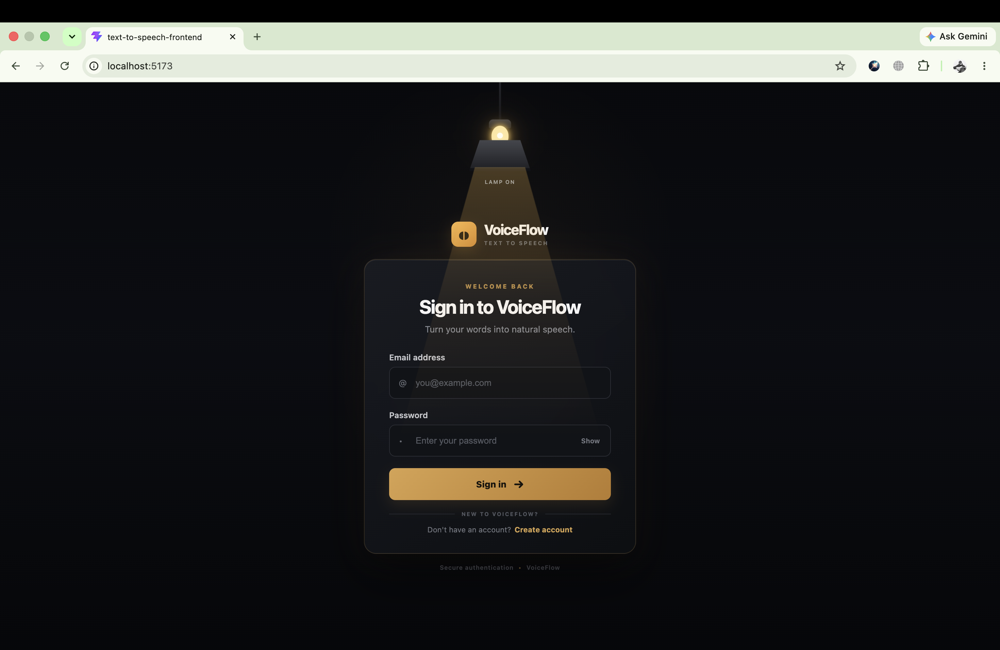
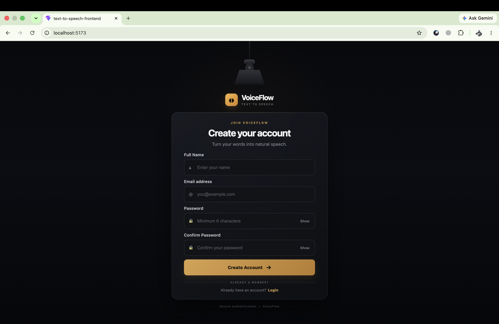
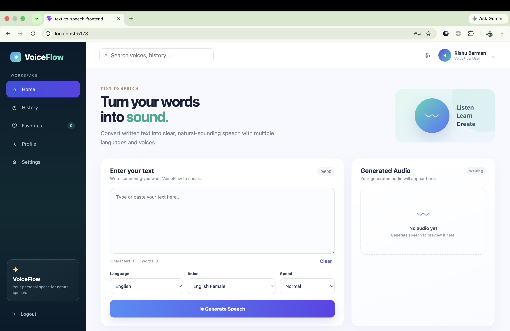
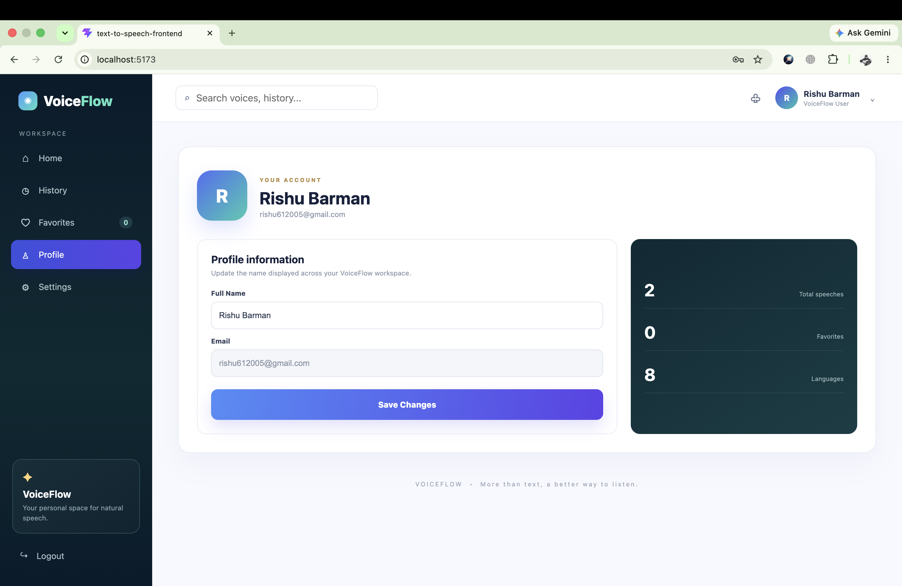
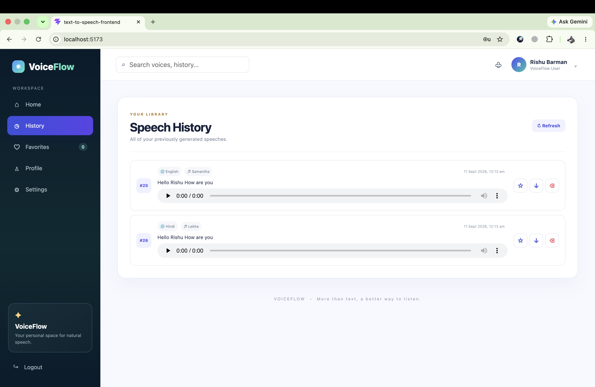

# 🔊 Text-to-Speech Application

A full-stack Text-to-Speech web application built with **React.js** and **Java Spring Boot**.

The application allows users to enter text, select a language and voice, generate speech, listen to the generated audio, download it, and manage their account.

---

## 🚀 Features

### 🎙️ Text-to-Speech
- Enter or paste text
- Generate natural-sounding speech
- Audio playback directly in the browser
- Download generated audio

### 🌍 Language & Voice Selection
- Select supported languages
- Select available voices
- Generate speech based on the selected configuration

### 👤 Authentication
- User registration
- User login
- JWT-based authentication
- Protected backend endpoints

### 📜 Speech History
- Store generated speech history
- View previously generated speech
- Access generated audio

### ❤️ Favorites
- Save frequently used speech/voices as favorites

### ⚙️ Settings & Profile
- User profile
- Application settings
- Account management

### 🛡️ Validation & Error Handling
- Empty text validation
- Password validation
- Confirm password validation
- API error handling
- Network error handling
- Backend validation

---

## 🛠️ Technology Stack

### Frontend

- React.js
- JavaScript
- HTML5
- CSS3
- Vite
- Fetch API

### Backend

- Java
- Spring Boot
- Spring Web
- Spring Security
- JWT Authentication
- Maven

### Database

- Database integration through Spring Data
- User management
- Speech history storage

### Development Tools

- IntelliJ IDEA
- VS Code
- Git
- GitHub
- Postman
- Maven
- Node.js

---

## 🏗️ Architecture

```text
                    ┌─────────────────────┐
                    │      React.js       │
                    │      Frontend       │
                    └──────────┬──────────┘
                               │
                               │ REST API
                               ▼
                    ┌─────────────────────┐
                    │    Spring Boot      │
                    │      Backend        │
                    └──────────┬──────────┘
                               │
              ┌────────────────┼────────────────┐
              │                │                │
              ▼                ▼                ▼
        Authentication      TTS Service      Database
              │                │                │
              ▼                ▼                ▼
             JWT          Audio Generation   User/History
                               │
                               ▼
                    ┌─────────────────────┐
                    │    Audio Response   │
                    └──────────┬──────────┘
                               │
                               ▼
                    ┌─────────────────────┐
                    │   React Audio       │
                    │      Player         │
                    └─────────────────────┘

## 📸 Screenshots

### 🔐 Login


### 📝 Register


### 🏠 Home


### 👤 Profile


### 📜 History
